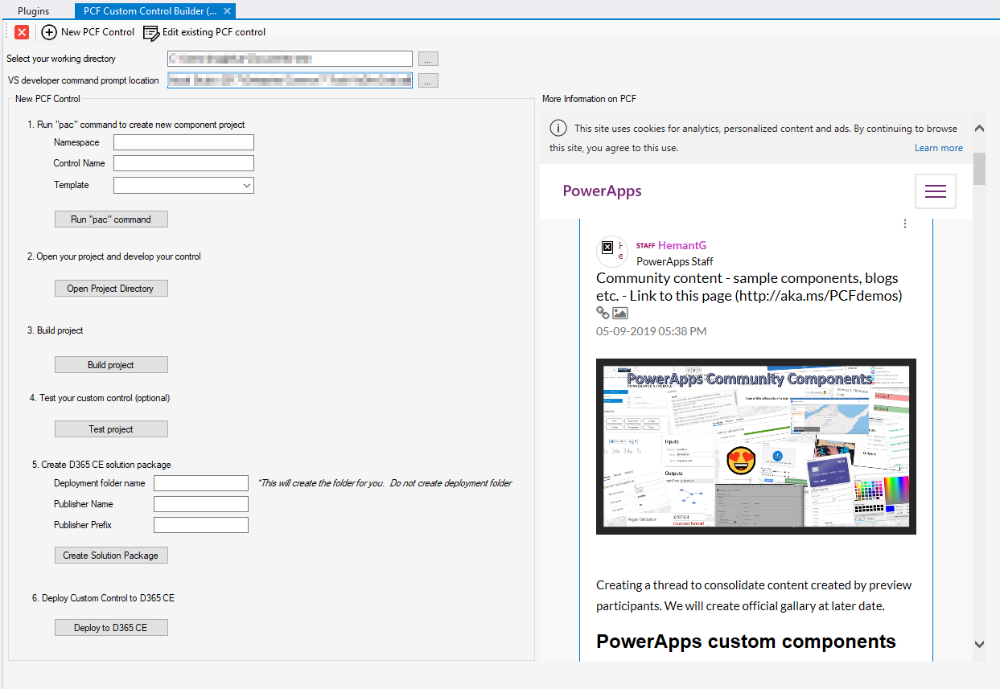
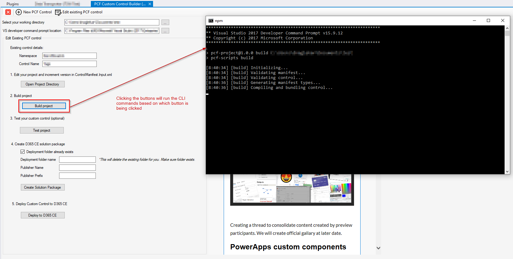

# PCF-CustomControlBuilder
Xrm Toolbox Plugin for building and deploying custom control using PCF

## Overview
This tool makes it easy to create and build PCF custom control by removing the need to write commands. 
It runs all the necessary commands in the order in which they need to be executed and using proper folder location to execute the commands. 
This tool also makes it easy to deploy the solution into D365 CE.

## Pre-Requisite
1. Install _npm_ from [here](https://nodejs.org/en/) - any version of _npm_ will do
2. Visual Studio
3. PowerApps CLI. Download it from [here](https://aka.ms/PowerAppsCLI)

## Usage
Before you begin with your custom control you need to specify the working folder for your custom control along with path to Visual Studio Developer Command Prompt (VsDevCmd.bat).
Once you have defined the working folder and path to VS Command Prompt you can click on either you want to create a new custom control or edit an existing one. 
Based on that different windows will open and guide you through the process.

## Screenshots

##### Creating New Custom Control

##### Tool executing commands

